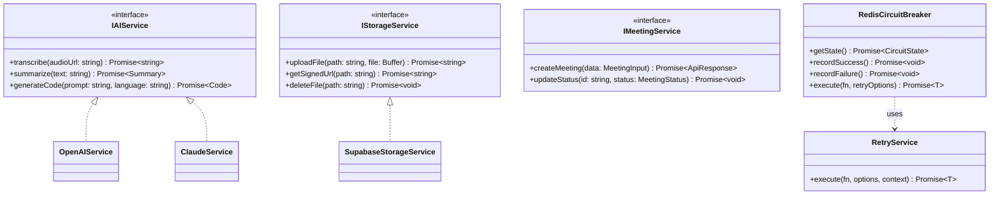

# Low-Level Design (LLD) - SupersmartX

## 1. Class & Interface Diagrams

### Core Service Interfaces
The system uses interfaces to decouple business logic from specific implementations (e.g., AI providers, storage backends).



## 2. Service Interfaces
Defined in `src/types/services.ts`.

| Interface | Responsibility | Key Methods |
|-----------|----------------|-------------|
| `IAIService` | Orchestrates AI operations | `transcribe`, `summarize`, `generateCode` |
| `IStorageService` | Manages file persistence | `uploadFile`, `getSignedUrl` |
| `IMeetingService` | Meeting lifecycle management | `createMeeting`, `updateStatus` |
| `IQuotaService` | Usage & Entitlement management | `hasFeature`, `checkMeetingQuota` |

## 3. Quota & Feature Governance
Defined in `src/lib/quota.ts` and integrated via `DataGovernance`.

### Plan Tiers
- **FREE**: 50k tokens/mo, 2 meetings/day, basic features.
- **PRO**: 500k tokens/mo, 10 meetings/day, all AI features.
- **ENTERPRISE**: 5M tokens/mo, unlimited (100+) meetings/day, custom prompts & RBAC.

### Monitoring & Alerts
- **Threshold Alerts**: System notifications triggered at 80% usage.
- **Hard Caps**: Immediate rejection of requests once limits are reached (Deterministic enforcement).
- **Feature Flags**: Tier-based access control to specific AI pipelines (e.g., Code Generation).

## 4. Error Handling Strategy
We use a standardized `ApiResponse` structure for all API and Service-level communications.

### Error Categories
- **Validation Errors (400)**: Handled via Zod schemas in `src/lib/validations`.
- **Authentication Errors (401/403)**: Handled via Next-Auth and custom decorators.
- **Service Errors (500/503)**: Wrapped in `ApiErrorCode` and logged with context.

### Error Codes (`ApiErrorCode`)
- `VALIDATION_ERROR`: Input failed schema check.
- `UNAUTHORIZED`: Missing or invalid session.
- `NOT_FOUND`: Resource does not exist.
- `RATE_LIMIT_EXCEEDED`: Too many requests.
- `INTERNAL_ERROR`: Unexpected server failure.

## 4. Retry & Resilience Logic
To ensure high availability, external service calls are wrapped in a combination of **Circuit Breakers** and **Exponential Backoff Retries**.

### Retry Logic (`RetryService`)
- **Strategy**: Exponential backoff with jitter.
- **Configuration**:
  - `maxAttempts`: 3 (default)
  - `initialDelayMs`: 1000ms
  - `backoffFactor`: 2
  - `jitter`: ±10%

### Resilience Pattern
The `RedisCircuitBreaker` in `src/lib/circuit-breaker.ts` manages the state of external dependencies:
1. **CLOSED**: Normal operation. Calls pass through.
2. **OPEN**: Service is failing. Calls are rejected immediately to save resources.
3. **HALF_OPEN**: Periodic probe to see if the service has recovered.

```typescript
// Example usage in AI Pipeline
await aiCircuitBreaker.execute(
  () => aiProvider.transcribe(url),
  { maxAttempts: 5, initialDelayMs: 2000 }
);
```
