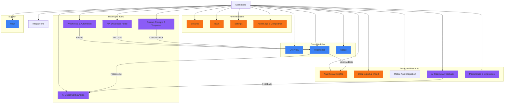

# Product Surface Architecture & Design

## Overview

This document provides a comprehensive architectural view of SmartMeet's product surfaces, including both existing and proposed surfaces, their relationships, and design considerations.

## Architecture Diagram



## Surface Relationship Matrix

| Surface | Depends On | Provides Data To | User Roles |
|---------|------------|------------------|------------|
| Overview | Recordings, Usage | All | User, Admin |
| Recordings | AIConfig, Templates | Analytics, Data | User, Admin |
| Analytics | Recordings, Usage | Reports | Admin |
| AIConfig | Developers | Recordings, Templates | Admin, Dev |
| Automation | Developers, Recordings | External Systems | Admin, Dev |
| Developers | AIConfig, Automation | External Apps | Dev |
| Templates | AIConfig | Recordings | User, Admin |
| Training | AIConfig, Recordings | AI Models | Admin |
| Audit | Security, Team | Compliance | Admin |
| Data | Recordings, Analytics | External Systems | Admin |

## Detailed Surface Specifications

### 1. Analytics & Insights Surface

**Technical Requirements:**
- Data visualization library (Chart.js, D3.js)
- Date range picker component
- Export functionality (CSV, PDF, PNG)
- Real-time data updates via WebSocket

**Data Model:**
```typescript
interface AnalyticsData {
  meetingTrends: {
    date: string;
    count: number;
    avgDuration: number;
  }[];
  aiPerformance: {
    provider: string;
    avgProcessingTime: number;
    successRate: number;
  }[];
  userActivity: {
    userId: string;
    meetingCount: number;
    lastActive: string;
  }[];
}
```

### 2. API Developer Portal

**Technical Requirements:**
- API key generation and management
- Rate limiting visualization
- Interactive API documentation (Swagger/OpenAPI)
- Webhook testing sandbox

**Security Considerations:**
- API key encryption at rest
- Rate limiting per API key
- IP whitelisting
- Usage monitoring and alerts

### 3. AI Model Configuration

**Technical Requirements:**
- Model parameter sliders (temperature, max tokens)
- Provider selection dropdown
- Performance comparison charts
- Test prompt interface

**AI Provider Integration:**
```typescript
interface AIProviderConfig {
  provider: 'openai' | 'claude' | 'gemini' | 'groq';
  model: string;
  temperature: number;
  maxTokens: number;
  systemPrompt: string;
  apiKey: string; // Encrypted
}
```

### 4. Webhooks & Automation

**Technical Requirements:**
- Webhook URL validation
- Event type selection
- Payload customization
- Delivery logs with retry mechanism

**Event Types:**
- `meeting.uploaded`
- `meeting.processed`
- `meeting.failed`
- `action_item.created`
- `action_item.completed`

### 5. Data Export & Import

**Technical Requirements:**
- File format selection (JSON, CSV, PDF)
- Data mapping interface
- Progress tracking
- Scheduled exports

**Export Formats:**
```typescript
type ExportFormat = 'json' | 'csv' | 'pdf' | 'docx';

interface ExportJob {
  id: string;
  format: ExportFormat;
  status: 'pending' | 'processing' | 'completed' | 'failed';
  createdAt: string;
  completedAt?: string;
  downloadUrl?: string;
}
```

## UI/UX Design Guidelines

### Navigation Patterns

1. **Primary Navigation**: Left sidebar with expandable sections
2. **Secondary Navigation**: Top tabs within each surface
3. **Contextual Actions**: Right-click menus and inline buttons
4. **Breadcrumbs**: For deep navigation paths

### Layout Templates

**Standard Surface Layout:**
```
[Header: Title + Actions]
[Filters/Controls Bar]
[Primary Content Area]
[Sidebar: Quick Actions/Info]
[Footer: Pagination/Status]
```

**Dashboard Widget Layout:**
```
[Widget Header: Title + Icon]
[Content Area]
[Footer: Metrics/Status]
```

### Color Coding System

- **Primary Actions**: Brand violet (#8b5cf6)
- **Success States**: Emerald green (#10b981)
- **Warning States**: Amber (#f59e0b)
- **Error States**: Red (#ef4444)
- **Information**: Sky blue (#0ea5e9)

## Accessibility Standards

1. **Keyboard Navigation**: All surfaces must be fully keyboard navigable
2. **Screen Reader Support**: Proper ARIA attributes and semantic HTML
3. **Color Contrast**: Minimum 4.5:1 contrast ratio for text
4. **Focus Management**: Clear focus indicators for interactive elements
5. **Alternative Text**: Descriptive alt text for all images and icons

## Performance Optimization

1. **Code Splitting**: Dynamic imports for surface components
2. **Lazy Loading**: Images and non-critical resources
3. **Caching**: Aggressive caching for static assets
4. **Bundle Analysis**: Regular bundle size monitoring
5. **Server-Side Rendering**: For initial page loads

## Security Architecture

1. **Authentication**: JWT with refresh tokens
2. **Authorization**: Role-based access control (RBAC)
3. **Data Protection**: Encryption at rest and in transit
4. **Input Validation**: Comprehensive validation on all surfaces
5. **Audit Logging**: All sensitive operations logged

## Implementation Checklist

For each new surface, ensure:

- [ ] API endpoints designed and documented
- [ ] Database schema updated (if needed)
- [ ] React components created with TypeScript
- [ ] State management implemented (Zustand/Redux)
- [ ] Error handling and user feedback
- [ ] Unit and integration tests
- [ ] End-to-end tests
- [ ] Documentation updated
- [ ] Accessibility audit completed
- [ ] Performance optimization applied

## Future Considerations

1. **Micro-frontends**: Potential to split surfaces into independent deployable units
2. **Theming**: Support for custom themes and branding
3. **Internationalization**: Full localization support
4. **Offline Mode**: Progressive web app capabilities
5. **Voice Interface**: Voice commands for hands-free operation

---
*Last Updated: 2026-01-24*
*Version: 1.0*
*Status: Design Specification*
